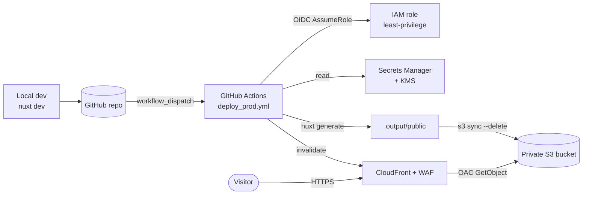

# Manideep Chittineni — Portfolio

A fast, statically-generated personal portfolio for a Cloud & DevOps engineer,
built with **Nuxt 3** and **Tailwind CSS v4**, deployed to **GitHub Pages** (with
alternative **AWS / Azure / GCP** CDN paths) via **GitHub Actions**.


> **Single source of truth: npm.** Use `package-lock.json` only — do not add
> other lockfiles (`pnpm-lock.yaml` / `yarn.lock`).

---

## Table of contents

- [Overview](#overview)
- [Tech stack](#tech-stack)
- [Architecture](#architecture)
- [Project structure](#project-structure)
- [Getting started](#getting-started)
- [Available scripts](#available-scripts)
- [Editing content](#editing-content)
- [Code style & quality](#code-style--quality)
- [Building for production](#building-for-production)
- [Deployment](#deployment)
- [Accessibility, SEO & performance](#accessibility-seo--performance)
- [Roadmap](#roadmap)

---

## Overview

This is a single-page site with anchor-navigated sections — **About / Hero**,
**Skills**, **Experience**, and **Contact**. It is rendered ahead of time with
Nuxt's static generation (`nuxt generate`), so the deployed artifact is plain
HTML/CSS/JS with no server runtime. The design is a dark, glassmorphism theme
with a single indigo→cyan accent, lightweight scroll-reveal animations
(progressive enhancement — content remains fully visible without JavaScript),
and a responsive nav with a mobile menu.

## Tech stack

| Layer         | Choice                                                                                                                    |
| ------------- | ------------------------------------------------------------------------------------------------------------------------- |
| Framework     | [Nuxt 3](https://nuxt.com) (Vue 3, `<script setup>`)                                                                      |
| Rendering     | Static Site Generation (Nitro `static` preset, all routes prerendered)                                                    |
| Styling       | [Tailwind CSS v4](https://tailwindcss.com) via `@nuxtjs/tailwindcss` + a plain-CSS design system in `assets/css/main.css` |
| Fonts         | Inter (Google Fonts, preconnected)                                                                                        |
| Hosting       | **GitHub Pages** (primary), or **AWS / Azure / GCP** CDN (alternatives; see [`infra/`](infra/))                           |
| Edge security | WAF (AWS/Azure), TLS 1.2+, security response headers + **CSP**, encrypted deploy secret                                   |
| CI/CD         | **GitHub Actions** with OIDC across all clouds (no long-lived keys); CI gate + gitleaks + Dependabot                      |
| IaC           | **CloudFormation** (AWS) _and_ **Terraform** for all three clouds (see [`infra/`](infra/))                                |
| Tooling       | Prettier, PostCSS, Autoprefixer                                                                                           |

## Architecture



The deploy job builds the static site, syncs it to the private S3 bucket, and
invalidates the CloudFront cache. CloudFront reads from S3 using Origin Access
Control (OAC); the bucket itself blocks all public access. The **Azure** (Storage
Account and Front Door) and **GCP** (Cloud Storage and Cloud CDN) paths are
equivalent — private origin → CDN → edge security headers, deployed by the same
workflow. Full per-cloud details — parameters, deploy order, and security
posture — are in [`infra/README.md`](infra/README.md).

## Project structure

```
.
├── app.vue                     # App shell: nav (+ mobile menu), <main>, footer
├── nuxt.config.ts              # SSG config, <head> (SEO/OG/Twitter), fonts
├── tailwind.config.js          # Tailwind theme extensions
├── assets/css/main.css         # Design system: tokens, components, animations
├── components/
│   ├── AboutSection.vue        # Hero (id="about")
│   ├── SkillsSection.vue       # Skills, proficiency, certifications (data-driven)
│   ├── ExperienceSection.vue   # Work timeline (data-driven)
│   └── ContactSection.vue      # Contact form (mailto) + info + socials
├── plugins/
│   └── reveal.client.ts        # IntersectionObserver scroll-reveal (client-only)
├── public/                     # Served as-is: profile.jpg, resume PDF, robots.txt, .nojekyll
├── infra/                      # IaC per cloud: AWS/ (CFN + Terraform), Azure/, GCP/ (Terraform)
└── .github/
    ├── dependabot.yml          # Weekly npm + github-actions update PRs
    └── workflows/
        ├── ci.yml              # PR/push gate: format, build, npm audit, gitleaks
        ├── deploy_pages.yml    # Auto deploy to GitHub Pages (push to main)
        └── deploy_prod.yml     # Manual deploy → AWS / Azure / GCP (toggleable)
```

## Getting started

### Prerequisites

- **Node.js 22.x** (matches the CI runner)
- **npm** (ships with Node)

### Install & run

```bash
npm ci          # install exact, locked dependencies
npm run dev     # start the dev server at http://localhost:3000
```

## Available scripts

| Script                 | Description                                                      |
| ---------------------- | ---------------------------------------------------------------- |
| `npm run dev`          | Start the Nuxt dev server with HMR on `:3000`                    |
| `npm run build`        | Build the app (server + client bundles)                          |
| `npm run generate`     | **Prerender the static site** into `.output/public` (used by CI) |
| `npm run preview`      | Locally preview the built output                                 |
| `npm run format`       | Format the codebase with Prettier                                |
| `npm run format:check` | Verify formatting (CI gate; non-zero on drift)                   |

## Editing content

Section content is **data-driven** — edit the arrays in `<script setup>` rather
than the markup:

| To change…                                   | Edit                                                                                                                         |
| -------------------------------------------- | ---------------------------------------------------------------------------------------------------------------------------- |
| Name, hero tagline, headline stats           | [`components/AboutSection.vue`](components/AboutSection.vue)                                                                 |
| Skills, proficiency bars, certifications     | the `categories` / `proficiency` / `certifications` arrays in [`components/SkillsSection.vue`](components/SkillsSection.vue) |
| Roles, dates, metrics, bullet points         | the `jobs` array in [`components/ExperienceSection.vue`](components/ExperienceSection.vue)                                   |
| Email, location, social links                | the `details` / `socials` arrays in [`components/ContactSection.vue`](components/ContactSection.vue) and `app.vue`           |
| Page `<title>`, description, OG/Twitter tags | [`nuxt.config.ts`](nuxt.config.ts)                                                                                           |
| Résumé PDF / profile photo                   | replace files in [`public/`](public/) (keep the same filenames)                                                              |

## Code style & quality

Formatting is enforced with **Prettier** (config in `.prettierrc`,
`.prettierignore`). Run `npm run format` before committing; CI runs
`npm run format:check` and fails the deploy on any unformatted file.

## Building for production

```bash
npm run generate      # outputs static files to .output/public
npm run preview       # serve the production build locally to verify
```

The `.output/public` directory is what gets synced to S3. It includes
`index.html`, a prerendered `404.html`, hashed `_nuxt/` assets, and everything
under `public/`.

## Deployment

Two hosting paths are configured — use whichever you prefer (don't run both
against the same domain).

### GitHub Pages (primary)

On every push to `main` (or a manual run),
[`.github/workflows/deploy_pages.yml`](.github/workflows/deploy_pages.yml)
generates the static site and publishes it to **GitHub Pages** via the official
`actions/deploy-pages` flow. It builds with `NUXT_APP_BASE_URL=/<repo>/` so assets
resolve under the project-page subpath (`https://<user>.github.io/<repo>/`), and
ships [`public/.nojekyll`](public/.nojekyll) so the `_nuxt/` directory isn't
stripped by Jekyll.

**One-time setup:** GitHub → **Settings → Pages → Build and deployment → Source:
GitHub Actions**. The deploy URL appears on the workflow's `github-pages`
environment.

> **Custom domain / user site at root?** Set `NUXT_APP_BASE_URL` to `/` in the
> workflow and add a `CNAME`. Note: GitHub Pages cannot set custom response
> headers (no HSTS/CSP) — the AWS/CloudFront path can.

### Cloud CDN — AWS / Azure / GCP (alternative)

A manual **`workflow_dispatch`** run of
[`.github/workflows/deploy_prod.yml`](.github/workflows/deploy_prod.yml) **builds
the site once** and fans the artifact out to whichever clouds you enable via the
run's checkboxes (`deploy_aws` / `deploy_azure` / `deploy_gcp`). Each cloud job
authenticates with **GitHub OIDC** (no stored keys), reads its resource names
from the deploy secret it provisioned, syncs the files, and invalidates the CDN.
A `concurrency` group serializes deploys.

**Required GitHub secrets / variables** (set from each stack's `terraform output`):

| Cloud | Secrets                                                       | Variables         |
| ----- | ------------------------------------------------------------- | ----------------- |
| AWS   | `AWS_DEPLOY_ARN`, `AWS_DEPLOY_REGION`, `SECRETS_MANAGER_ARN`  | —                 |
| Azure | `AZURE_CLIENT_ID`, `AZURE_TENANT_ID`, `AZURE_SUBSCRIPTION_ID` | `AZURE_KEY_VAULT` |
| GCP   | `GCP_WORKLOAD_IDENTITY_PROVIDER`, `GCP_SERVICE_ACCOUNT`       | `GCP_PROJECT`     |

The repo must also define a **`Prod`** GitHub environment (every deploy job runs
in it, and each OIDC trust is scoped to `environment:Prod` by default).

➡️ **Per-cloud provisioning, the deploy-identity matrix, and the security model
are documented in [`infra/README.md`](infra/README.md).**

## Accessibility, SEO & performance

- **A11y:** skip link, semantic landmarks, ARIA on the mobile-menu toggle,
  visible focus states, and a `prefers-reduced-motion` block that disables
  animations and reveals.
- **SEO:** `<html lang="en">`, meta description, Open Graph and Twitter Card
  tags, and a `robots.txt`. _(Set `og:image`/`twitter:image` to an absolute URL
  once a production domain is configured — social crawlers don't resolve
  relative paths.)_
- **Performance:** static prerender, CloudFront compression + caching,
  preconnected fonts, lazy-loaded brand icons, and a JS-light reveal mechanism.

© Manideep Chittineni. All rights reserved.
