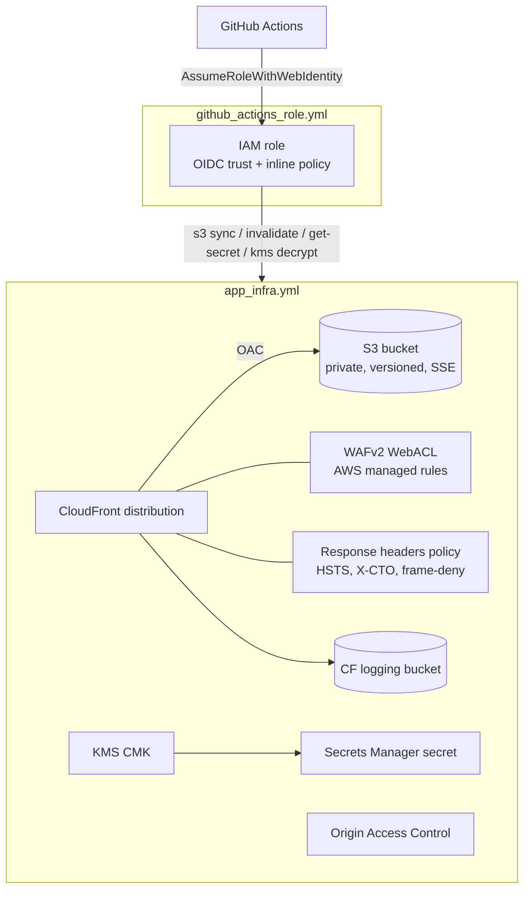

# Infrastructure

CloudFormation templates that host the portfolio on AWS and grant CI a
least-privilege deploy role. Two independent stacks:

| Template                                             | Stack purpose                                                                                                                                          |
| ---------------------------------------------------- | ------------------------------------------------------------------------------------------------------------------------------------------------------ |
| [`app_infra.yml`](app_infra.yml)                     | The hosting stack: private S3 bucket, CloudFront (OAC) + WAFv2, security response headers, access-logging bucket, KMS-encrypted Secrets Manager secret |
| [`github_actions_role.yml`](github_actions_role.yml) | The IAM role GitHub Actions assumes via OIDC, scoped to exactly what the deploy needs                                                                  |

## Architecture



## Prerequisites

1. An AWS account and credentials able to create the above resources.
2. A **GitHub OIDC provider** in the account (created once, not by these
   templates):
   ```bash
   aws iam create-open-id-connect-provider \
     --url https://token.actions.githubusercontent.com \
     --client-id-list sts.amazonaws.com
   ```
3. **Region:** deploy in **`us-east-1`** when `EnableWaf=true` (CloudFront-scoped
   WAFv2 WebACLs must live in `us-east-1`) and when using a custom domain (ACM
   certificates for CloudFront must be in `us-east-1`). To deploy elsewhere, pass
   `EnableWaf=false` and omit the custom domain.

## Deploy order

The role stack consumes outputs from the hosting stack, so deploy the hosting
stack first.

### 1. Hosting stack (`app_infra.yml`)

```bash
aws cloudformation deploy \
  --region us-east-1 \
  --stack-name portfolio-app \
  --template-file infra/app_infra.yml \
  --parameter-overrides \
      BucketName=<globally-unique-bucket-name> \
      EnableWaf=true
# Optional custom domain:
#     DomainName=www.example.com \
#     AcmCertificateArn=arn:aws:acm:us-east-1:<acct>:certificate/<id>

aws cloudformation describe-stacks --region us-east-1 \
  --stack-name portfolio-app \
  --query 'Stacks[0].Outputs' --output table
```

Note the outputs — `S3BucketName`, `DistributionId`, `SecretArn`,
`SecretsKmsKeyArn`, `CloudFrontURL`.

### 2. Role stack (`github_actions_role.yml`)

Creates a named IAM role, so it needs `CAPABILITY_NAMED_IAM`.

```bash
aws cloudformation deploy \
  --region us-east-1 \
  --stack-name portfolio-github-role \
  --template-file infra/github_actions_role.yml \
  --capabilities CAPABILITY_NAMED_IAM \
  --parameter-overrides \
      GitHubOrg=<org-or-user> \
      GitHubRepo=<repo-name> \
      DeployBucketName=<S3BucketName output> \
      DistributionId=<DistributionId output> \
      SecretArn=<SecretArn output> \
      SecretsKmsKeyArn=<SecretsKmsKeyArn output>
```

### 3. Wire up GitHub

Set repository secrets (Settings → Secrets and variables → Actions):

| Secret                | From                                                      |
| --------------------- | --------------------------------------------------------- |
| `AWS_DEPLOY_ARN`      | `IAMRoleArn` output of the role stack                     |
| `AWS_DEPLOY_REGION`   | the region the stacks were deployed in (e.g. `us-east-1`) |
| `SECRETS_MANAGER_ARN` | `SecretArn` output of the hosting stack                   |

Create a **`Prod`** environment in the repo (the deploy job runs in it and the
role's OIDC trust is scoped to `environment:Prod` by default). Then run the
**Deploy Website (Prod)** workflow from the Actions tab.

## `app_infra.yml` parameters

| Parameter           | Default             | Description                                                                           |
| ------------------- | ------------------- | ------------------------------------------------------------------------------------- |
| `BucketName`        | _(required)_        | Globally-unique S3 bucket name (3–63 chars, lowercase)                                |
| `SecretName`        | `PortfolioSecret`   | Secrets Manager secret name. Drives the workflow env-var prefix (`PORTFOLIOSECRET_…`) |
| `EnvironmentType`   | `Prod`              | Tag value                                                                             |
| `ProjectName`       | `Portfolio-Project` | Tag value                                                                             |
| `TeamName`          | `MC`                | Tag value                                                                             |
| `DomainName`        | `''`                | Optional custom domain (CNAME alias). Requires `AcmCertificateArn`                    |
| `AcmCertificateArn` | `''`                | Optional ACM cert ARN **in us-east-1** for the custom domain                          |
| `EnableWaf`         | `'true'`            | Attach the WAFv2 WebACL (requires us-east-1)                                          |

### `app_infra.yml` outputs

`CloudFrontURL`, `DistributionId`, `S3BucketName`, `CloudFrontLoggingBucketName`,
`SecretArn`, `SecretsKmsKeyArn`.

## `github_actions_role.yml` parameters

| Parameter                                      | Default                             | Description                                                                                                                |
| ---------------------------------------------- | ----------------------------------- | -------------------------------------------------------------------------------------------------------------------------- |
| `GitHubOrg`                                    | _(required)_                        | GitHub org/user that owns the repo                                                                                         |
| `GitHubRepo`                                   | _(required)_                        | Repository name allowed to assume the role                                                                                 |
| `GitHubSubjectClaim`                           | `environment:Prod`                  | OIDC `sub` suffix the role trusts. Use `ref:refs/heads/main` for a branch, or `*` (**not recommended**) for any ref/PR/tag |
| `DeployBucketName`                             | _(required)_                        | Bucket the role may write to (the `S3BucketName` output)                                                                   |
| `DistributionId`                               | `*`                                 | CloudFront distribution allowed for invalidations                                                                          |
| `SecretArn`                                    | `*`                                 | Secrets Manager secret the role may read                                                                                   |
| `SecretsKmsKeyArn`                             | `*`                                 | KMS key the role may use to decrypt the secret                                                                             |
| `EnvironmentType` / `ProjectName` / `TeamName` | `Prod` / `Portfolio-Project` / `MC` | Tag values                                                                                                                 |

Output: `IAMRoleArn`.

## How the deploy secret feeds the workflow

`app_infra.yml` stores a JSON secret:

```json
{ "DistributionId": "<distribution id>", "S3Bucket": "<bucket name>" }
```

The deploy job reads it with `aws-actions/aws-secretsmanager-get-secrets`
(`parse-json-secrets: true`), which exposes each key as an env var prefixed with
the secret name. With the default `SecretName=PortfolioSecret` that yields
`PORTFOLIOSECRET_S3BUCKET` and `PORTFOLIOSECRET_DISTRIBUTIONID`, used by the
`s3 sync` and CloudFront invalidation steps respectively. **If you change
`SecretName`, the env-var prefix changes too** — update the workflow to match.

## Security model

- **No public bucket access** — all four S3 Public Access Block flags on; the
  origin is reachable only through CloudFront via Origin Access Control (OAC).
- **No long-lived keys** — CI authenticates with GitHub OIDC; the trust policy
  is scoped to a single repo and (by default) the `Prod` environment.
- **Least-privilege role** — inline policy grants only `s3:Get/Put/Delete/List`
  on the deploy bucket, `cloudfront:CreateInvalidation/GetInvalidation`,
  `secretsmanager:GetSecretValue`, and `kms:Decrypt`.
- **Edge protection** — WAFv2 with AWS managed rule groups
  (`CommonRuleSet`, `KnownBadInputsRuleSet`), `redirect-to-https`, and a
  response-headers policy (HSTS w/ preload, `X-Content-Type-Options`,
  frame-deny, referrer policy).
  > TLS `MinimumProtocolVersion: TLSv1.2_2021` is only enforced for a **custom
  > ACM certificate**; the default `*.cloudfront.net` certificate uses AWS's
  > baseline. Configure a custom domain to enforce the 2021 floor.
- **Encryption** — S3 SSE (AES256), KMS CMK (with rotation) for the secret.
- **Auditing** — CloudFront standard access logs to a dedicated, lifecycle-managed
  logging bucket.

## Teardown

S3 buckets must be emptied before stack deletion (the primary bucket is
versioned — delete all versions too):

```bash
aws s3 rm s3://<bucket> --recursive
aws s3 rm s3://<bucket>-cf-logs --recursive
aws cloudformation delete-stack --stack-name portfolio-github-role --region us-east-1
aws cloudformation delete-stack --stack-name portfolio-app          --region us-east-1
```
